# UTB Tracker - Sistem Informasi Logbook & Absensi Magang

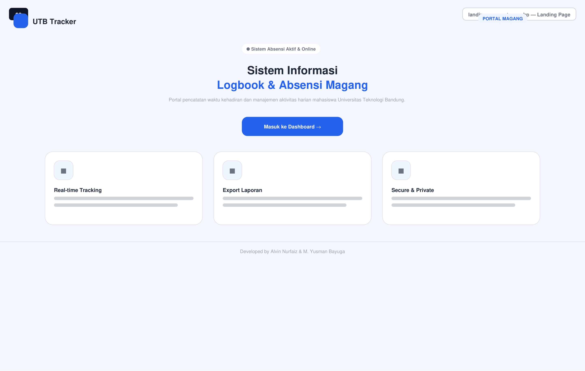

**UTB Tracker** adalah aplikasi berbasis web untuk pencatatan kehadiran (presensi), manajemen aktivitas harian (logbook), kalender agenda & milestone, serta **bimbingan magang dua arah** antara mahasiswa dan mentor/Pembimbing Lapangan di **Universitas Teknologi Bandung (UTB)**. 

Aplikasi ini dibangun menggunakan arsitektur dual-portal terpisah — **Portal Mahasiswa** dan **Portal Mentor** — yang terintegrasi secara real-time melalui alur approval, penugasan, dan rekapitulasi pelaporan.

---

## 🚀 Alur Kerja Sistem & Tampilan Antarmuka (Wireframe Showcase)

Sistem dirancang mengikuti alur kerja terstruktur mulai dari navigasi awal, autentikasi ganda, aktivitas harian mahasiswa, hingga evaluasi dan verifikasi oleh mentor lapangan.

---

### A. Routing Awal & Landing Page

#### 1. Smart Router & Pemilih Peran (index.php)
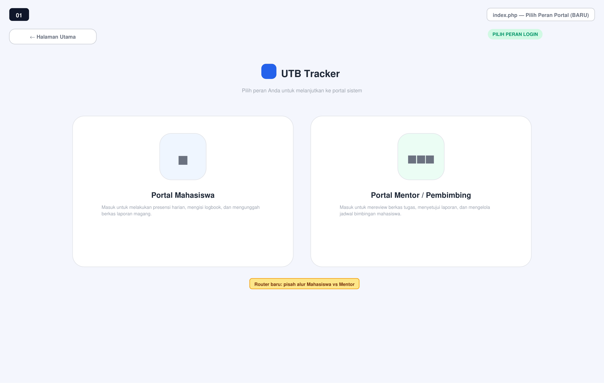
* Deskripsi: Halaman entry point utama yang berfungsi sebagai pengarah peran (role router). Pengguna dapat memilih untuk masuk sebagai Portal Mahasiswa atau Portal Mentor / Pembimbing Lapangan.
* Komponen & Fitur:
  * Card navigasi interaktif untuk memisahkan sesi dan hak akses sejak awal.
  * Menghindari overlapping antara hak akses mahasiswa dan mentor dalam sesi browser.

#### 2. Landing Page Utama (landing_page_utama.php)

* Deskripsi: Halaman informasi publik mengenai fungsi utama sistem UTB Tracker.
* Komponen & Fitur:
  * Banner pengenalan sistem presensi & logbook magang UTB.
  * Ringkasan keunggulan sistem: Real-time Tracking, Export Laporan PDF, serta Secure & Private Access.
  * Tombol navigasi langsung menuju portal dashboard.

---

### B. Registrasi Mandiri & Autentikasi Ganda (Dual-Role)

#### 3. Form Registrasi Mahasiswa (register_mahasiswa.php)
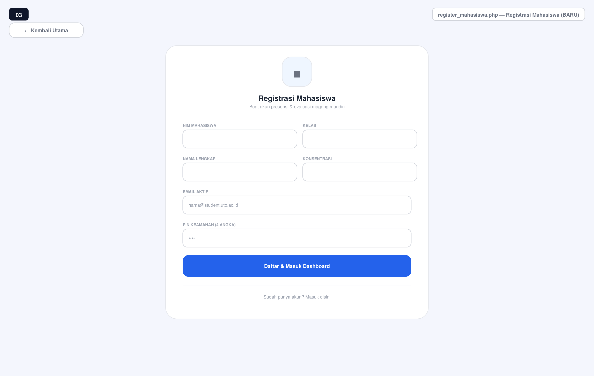
* Deskripsi: Halaman pendaftaran mandiri khusus untuk mahasiswa peserta Kerja Praktik / Magang.
* Komponen & Fitur:
  * Input NIM, Nama Lengkap, Kelas, Konsentrasi, Email Aktif, dan PIN Keamanan (4 Digit).
  * Enkripsi kata sandi berbasis Bcrypt (password_hash) sebelum disimpan ke database.
  * Fitur auto-login instan setelah akun berhasil didaftarkan.

#### 4. Form Registrasi Mentor / Pembimbing Lapangan (register_mentor.php)
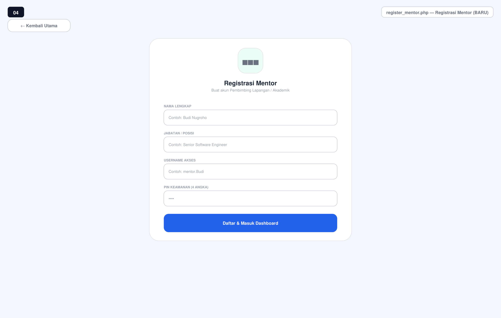
* Deskripsi: Halaman pendaftaran akun untuk Pembimbing Lapangan dari perusahaan/instansi partner maupun Dosen Pembimbing Akademik.
* Komponen & Fitur:
  * Input Nama Lengkap, Jabatan/Posisi Instansi, Username Akses, dan PIN Keamanan (4 Digit).
  * Pembuatan kredensial khusus untuk mengakses portal verifikasi & bimbingan.

#### 5. Portal Login Mahasiswa Berbasis Kartu & PIN (login.php)
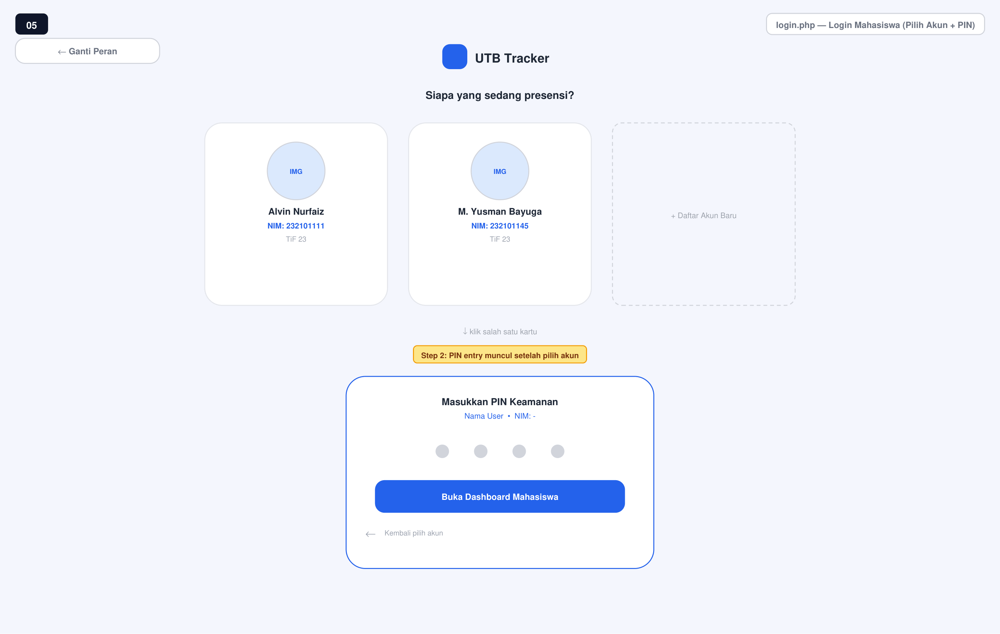
* Deskripsi: Antarmuka masuk dua langkah (two-step login) yang intuitif untuk mahasiswa.
* Komponen & Fitur:
  * Langkah 1: Pemilihan profil dari daftar kartu akun mahasiswa yang terdaftar di perangkat.
  * Langkah 2: Modal input PIN 4 digit dengan proteksi keamanan lockout (3 kali salah PIN -> akun terkunci otomatis selama 5 menit).

#### 6. Portal Login Mentor (login-mentor.php)
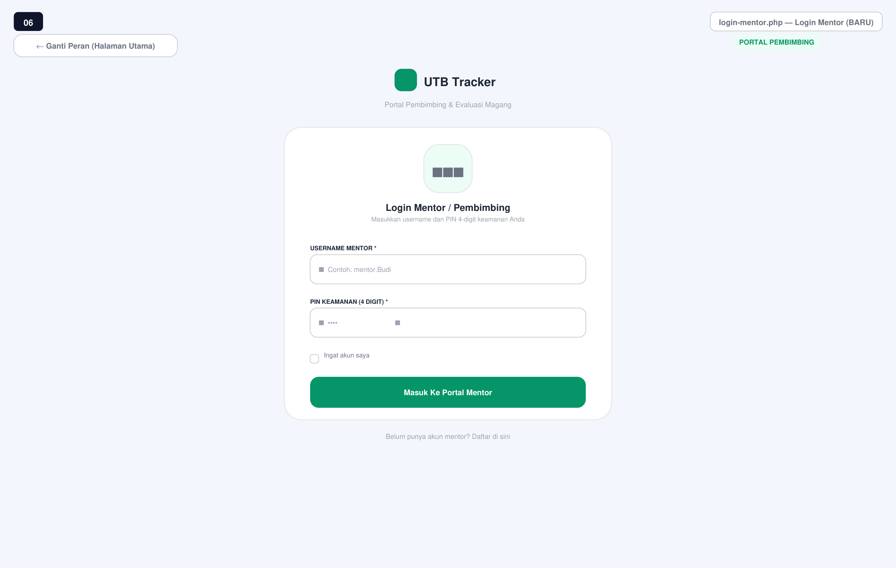
* Deskripsi: Halaman autentikasi khusus untuk Mentor / Pembimbing Lapangan.
* Komponen & Fitur:
  * Input Username dan PIN 4 digit.
  * Dilengkapi mekanisme rate limiting dan penanganan failed attempts berbasis kolom database failed_attempts dan lockout_time.

---

### C. Modul & Fitur Portal Mahasiswa

#### 7. Dashboard Utama & Real-time Presensi (mahasiswa/dashboard_mahasiswa.php)
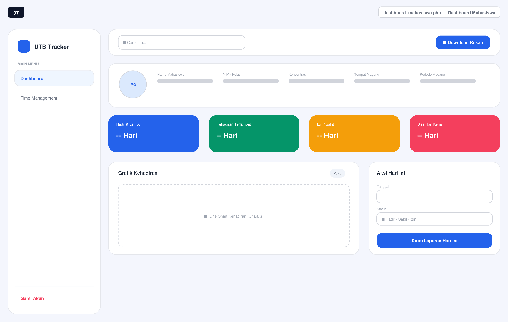
* Deskripsi: Pusat kendali aktivitas mahasiswa untuk melakukan presensi dan memantau ringkasan kehadiran.
* Komponen & Fitur:
  * Header Informasi Profil: Nama, NIM, Kelas, Konsentrasi, Tempat Magang, dan Periode Magang.
  * 4 Kartu Statistik Ringkas: Hadir & Lembur, Kehadiran Terlambat, Izin/Sakit, dan Sisa Hari Kerja.
  * Visualisasi Line Chart (Chart.js) untuk memantau tren akumulasi kehadiran bulanan.
  * Form Aksi Presensi Hari Ini: Pilihan status (Hadir, Sakit, Izin, Lembur) dan pemicu submit data absensi.

#### 8. Riwayat Kehadiran & Pengisian Logbook Harian (mahasiswa/dashboard_mahasiswa.php)
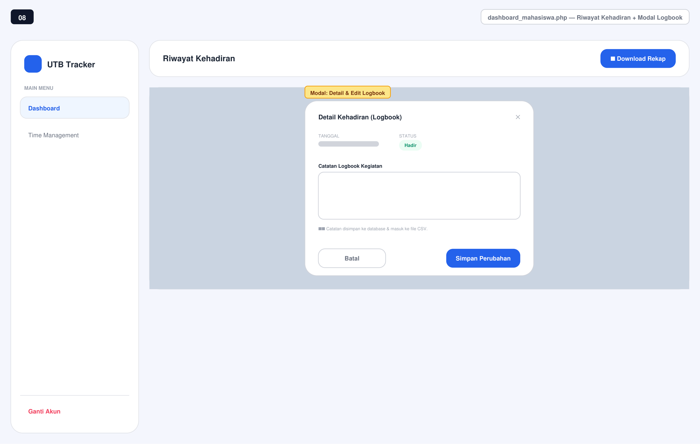
* Deskripsi: Tabel pencatatan riwayat absensi dan modul pengisian uraian pekerjaan harian.
* Komponen & Fitur:
  * Tabel riwayat kehadiran lengkap dengan Live Search dinamis pada topbar.
  * Modal Popup Pengisian Logbook: Tempat mahasiswa mengisikan uraian rincian kegiatan harian tanpa perlu berpindah halaman (AJAX-driven UX).
  * Tombol Download Rekap: Men-generate laporan rekapitulasi kehadiran dan logbook berformat PDF secara stream.

#### 9. Time Management, Milestone & Kalender Agenda (mahasiswa/time-management.php)
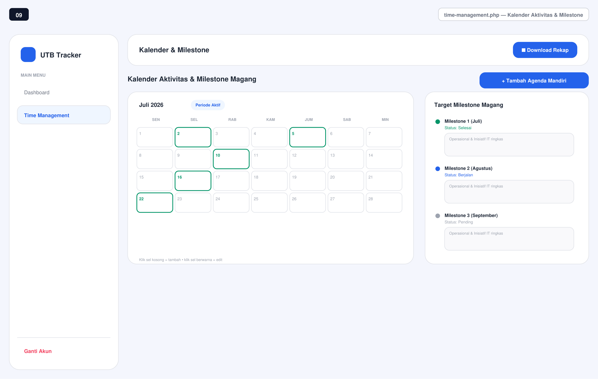
* Deskripsi: Modul perencanaan waktu untuk menyelaraskan agenda industri dengan target akademik kampus.
* Komponen & Fitur:
  * Grid Kalender Bulanan dengan pendeteksian otomatis Hari Libur Nasional Indonesia via integrasi API publik (dilengkapi local file caching per tahun di config/api_logs/).
  * Kategori Agenda: Industri, Kampus, dan Lembur.
  * Status Tracking Milestone: Pending, Berjalan, dan Selesai untuk memantau progres pencapaian target magang bulanan.

---

### D. Modul & Fitur Portal Mentor / Pembimbing Lapangan

#### 10. Dashboard Portal Mentor (mentor/dashboard.php)
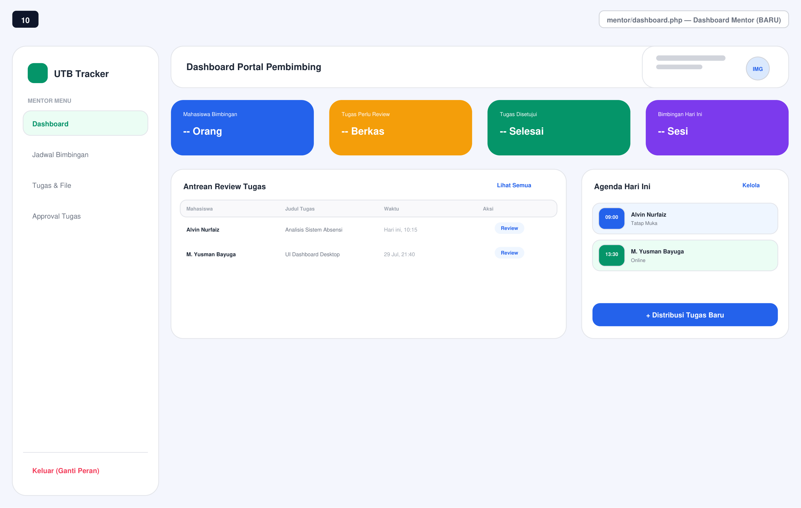
* Deskripsi: Ringkasan eksekutif untuk mentor dalam memantau seluruh mahasiswa bimbingannya.
* Komponen & Fitur:
  * 4 Kartu Metrik Utama: Mahasiswa Bimbingan, Tugas Perlu Review, Tugas Disetujui, dan Bimbingan Hari Ini.
  * Panel Antrean Review Tugas terkini yang membutuhkan tindakan mentor.
  * Panel Agenda Bimbingan Hari Ini & akses cepat pemicu penugasan baru.

#### 11. Verifikasi, Approval & Paraf Digital (mentor/approval.php)
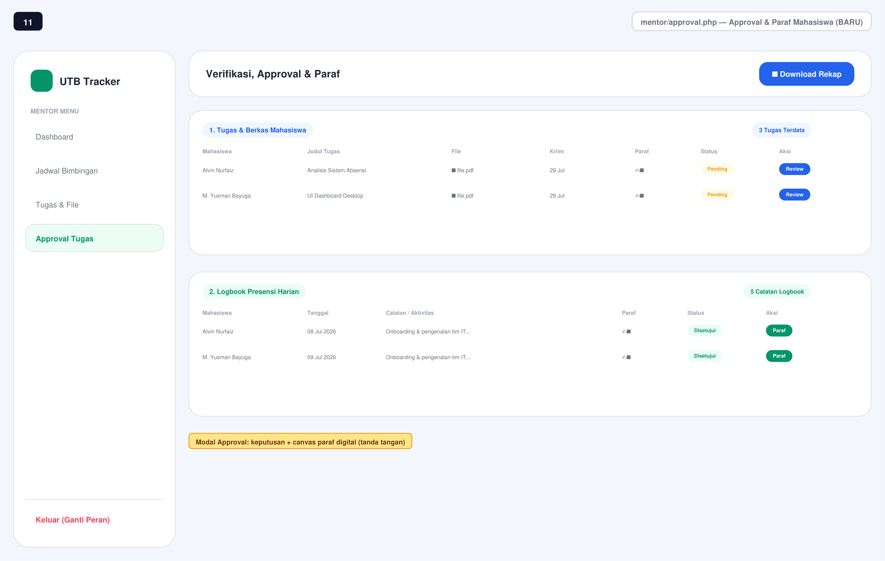
* Deskripsi: Modul pusat evaluasi dan validasi terhadap berkas tugas serta catatan logbook presensi harian mahasiswa.
* Komponen & Fitur:
  * Seksi 1 (Tugas & Berkas): Memeriksa file yang diunggah mahasiswa, menetapkan status (Disetujui / Revisi), dan memberikan catatan perbaikan.
  * Seksi 2 (Logbook Presensi Harian): Menyetujui absensi dan aktivitas harian mahasiswa.
  * Canvas Paraf Digital: Modal persetujuan interaktif yang dilengkapi pad tanda tangan/paraf digital berbasis HTML5 Canvas (disimpan sebagai skema string Base64 image pada database).

#### 12. Kalender Bimbingan & Catatan Revisi (mentor/bimbingan.php)
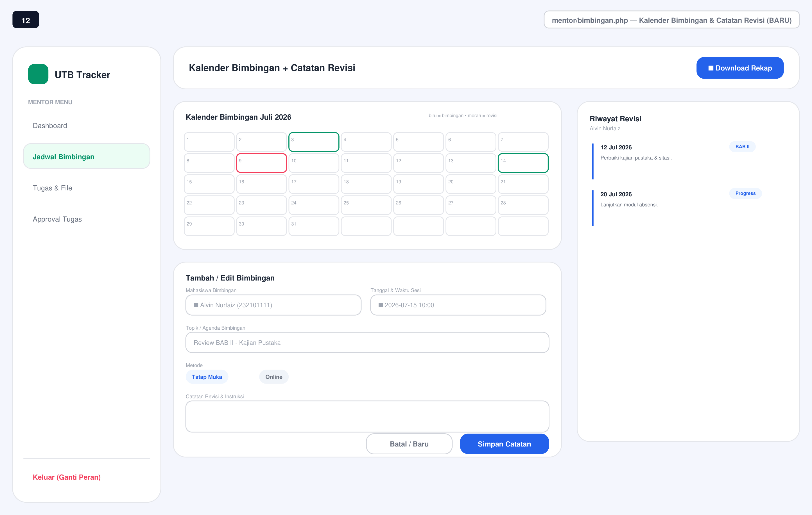
* Deskripsi: Modul penjadwalan sesi konsultasi serta inventarisasi riwayat catatan revisi bimbingan magang.
* Komponen & Fitur:
  * Kalender Sesi Bimbingan dengan penanda warna (Biru = Jadwal Bimbingan, Merah = Jadwal Revisi).
  * Form Pembuatan Sesi: Pilihan Mahasiswa Bimbingan, Tanggal/Waktu, Topik Bimbingan, Metode (Tatap Muka / Online), serta Catatan Instruksi.
  * Panel Timeline Riwayat Revisi untuk memantau konsistensi perbaikan laporan Kerja Praktik mahasiswa.

#### 13. Distribusi Tugas & Lampiran File (mentor/tugas.php)
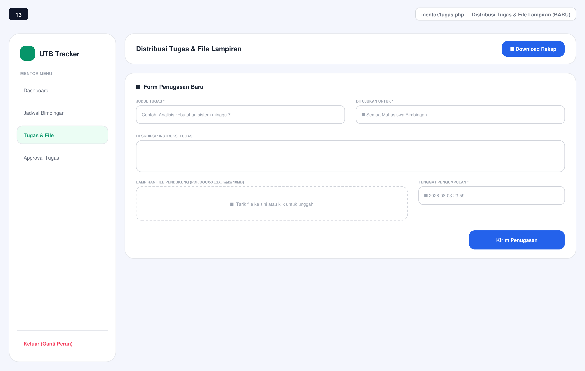
* Deskripsi: Modul instruksi kerja dan pengiriman tugas dari mentor ke mahasiswa bimbingan.
* Komponen & Fitur:
  * Form Penugasan Baru: Judul Tugas, Target Penerima (Semua Mahasiswa atau Mahasiswa Spesifik), Deskripsi/Instruksi Detail.
  * Upload Lampiran File Pendukung (dukungan format PDF, DOCX, XLSX hingga 10MB).
  * Penetapan Tenggat Pengumpulan (Deadline) terintegrasi dengan notifikasi di portal mahasiswa.

---

## 🔒 Fitur Keamanan Berlapis

1. Proteksi Lockout Otomatis:
   * Proteksi brute-force berbasis server: 3 kali salah PIN -> Akun terkunci 5 menit.
   * Dihitung secara presisi dari kolom failed_attempts dan lockout_time di database MySQL.
2. Anti-DDoS Layer 7 Custom Limiter (config/ddos_layer.php):
   * Rate limiter berbasis alamat IP dengan mekanisme penalty box.
   * Batas ambang: Lebih dari 20 request dalam kurun waktu 10 detik -> IP otomatis diblokir selama 24 jam.
   * Pembersihan otomatis (garbage collection) pada berkas log JSON di config/ddos_logs/ untuk log tidak aktif >5 menit.
3. Restriksi Direktori Uploads (uploads/.htaccess):
   * Eksekusi skrip PHP di dalam direktori uploads/ diblokir sepenuhnya.
   * Berkas hasil upload dipaksa berstatus attachment download (Content-Disposition: attachment), mencegah celah keamanan Stored XSS atau Remote Code Execution via berkas yang diunggah.
4. Keamanan Transaksional:
   * Validasi CSRF Token pada setiap form POST.
   * Hashing PIN Mahasiswa menggunakan algoritma Bcrypt.
   * Pencegahan SQL Injection menggunakan Prepared Statements (PDO / MySQLi).
   * Sanitasi keluaran antarmuka menggunakan htmlspecialchars untuk mencegah Cross-Site Scripting (XSS).

---

## 📄 Generator Laporan PDF (mahasiswa/export_excel.php)

Meskipun nama berkas mempertahankan konvensi legacy (export_excel.php), mesin utama di dalamnya telah diperbarui sepenuhnya untuk menghasilkan Laporan Rekapitulasi Presensi & Logbook PDF Resmi.
* Engine: Menggunakan library Dompdf (Lib/dompdf/) yang telah di-vendor secara lokal.
* Fitur Laporan: Menampilkan header instansi UTB, rekap jam kerja, uraian logbook harian, serta kolom tanda tangan/paraf resmi Pembina Kerja Praktik & Dosen Pembimbing.

---

## 🛠️ Teknologi yang Digunakan

* Frontend: HTML5, Tailwind CSS (via CDN), Vanilla JavaScript (ES6+), Chart.js, SweetAlert2.
* Backend: PHP Native (v8.x+, tanpa framework berat).
* Database: MySQL / MariaDB (8 tabel terintegrasi — lihat database/absensi_db.sql).
* PDF Rendering Engine: Dompdf (Vendored di Lib/dompdf/, berjalan tanpa dependensi Composer).
* Eksternal API: Public Indonesia National Holiday API (dengan local yearly caching).

---

## 📂 Struktur Direktori Proyek

```text
wazozky345-website-absensi-magang/
├── README.md                          # Dokumentasi utama proyek
├── index.php                          # Smart Router & Pemilih Peran Portal
├── landing_page_utama.php             # Landing Page Publik
├── login.php                          # Portal Autentikasi Mahasiswa
├── login-mentor.php                   # Portal Autentikasi Mentor
├── logout.php                         # Terminator Sesi
├── register_mahasiswa.php             # Registrasi Mandiri Mahasiswa (Bcrypt PIN)
├── register_mentor.php                # Registrasi Mandiri Mentor
├── assets/
│   ├── script.js                      # Chart.js initialization, live search & UI handlers
│   ├── style.css                      # Custom CSS override
│   └── picture/                       # Asset Wireframe & Screenshot (v2-01 s/d v2-13)
├── components/
│   ├── alert.php                      # Komponen global SweetAlert2
│   ├── sidebar.php                    # Navigation Sidebar — Mahasiswa
│   ├── sidebar_mentor.php             # Navigation Sidebar — Mentor
│   └── topbar.php                     # Navigation Topbar & Live Search Input
├── config/
│   ├── ddos_layer.php                 # Layer 7 Anti-DDoS Rate Limiter & Penalty Box
│   ├── koneksi.php                    # Konfigurasi Koneksi Database
│   ├── sesi.php                       # Session Manager & CSRF Token Generator
│   ├── api_logs/                      # Caching data API Hari Libur Nasional (JSON)
│   └── ddos_logs/                     # Rate limiting log per-IP (Auto-pruned)
├── database/
│   └── absensi_db.sql                 # DDL & Seed Data (8 Tabel)
├── Lib/
│   └── dompdf/                        # Dompdf HTML-to-PDF Engine (Vendored)
├── mahasiswa/
│   ├── dashboard_mahasiswa.php        # Dashboard, Presensi Harian & Logbook Modal
│   ├── export_excel.php               # Stream Laporan PDF Resmi via Dompdf
│   └── time-management.php            # Agenda Kalender, API Tanggal Merah & Milestone
├── mentor/
│   ├── approval.php                   # Approval Tugas, Logbook & Canvas Paraf Digital
│   ├── bimbingan.php                  # Jadwal Bimbingan & Log Catatan Revisi
│   ├── dashboard.php                  # Executive Dashboard Mentor
│   └── tugas.php                      # Form Penugasan & Distribusi Berkas Lampiran
├── proses/                            # Backend Process Controllers (11 Files)
│   ├── proses_dashboard.php           # Fetch Data Dashboard Mahasiswa
│   ├── proses_dashboard_mentor.php    # Fetch Data Dashboard Mentor
│   ├── proses_login.php               # Handlers Auth Mahasiswa & Lockout
│   ├── proses_login_mahasiswa.php     # Handlers Auth Profil Card Mahasiswa
│   ├── proses_login_mentor.php        # Handlers Auth Mentor
│   ├── proses_mentor_approval.php     # Handlers Approval, Catatan & Save Paraf Base64
│   ├── proses_mentor_bimbingan.php    # CRUD Sesi Bimbingan & Catatan Revisi
│   ├── proses_mentor_tugas.php        # CRUD Distribusi Penugasan Mentor
│   ├── proses_time_management.php     # CRUD Agenda, Milestone & Fetch API Libur
│   ├── proses_ubah_pin_mentor.php     # Handlers Perubahan PIN Mentor
│   └── proses_upload_tugas.php        # Handlers Unggah Berkas Balasan Mahasiswa
└── uploads/
    ├── .htaccess                      # Execution Blocker & Forced Attachment Downloader
    ├── tugas_mahasiswa/               # Repository Berkas Tugas Mahasiswa
    └── tugas_mentor/                  # Repository Lampiran File Penugasan Mentor

---

## 🗄️ Skema Tabel Database

| Nama Tabel | Fungsi Utama | Key Columns / Features |
|---|---|---|
| users | Entitas Data Mahasiswa | nim, pin (Bcrypt), failed_attempts, lockout_time |
| mentors | Entitas Data Mentor/Pembimbing | username, pin, jabatan, failed_attempts |
| kehadiran | Catatan Absensi & Logbook | tanggal, status, logbook_kegiatan, paraf_mentor, status_approval |
| agenda | Agenda Kalender | kategori (Industri/Kampus/Lembur), tanggal, keterangan |
| milestones | Target Capaian Bulanan | judul_milestone, bulan, status (Pending/Berjalan/Selesai) |
| bimbingan | Sesi Konsultasi Magang | mentor_id, nim, tanggal_waktu, metode, catatan_revisi |
| tugas | Master Penugasan Mentor | mentor_id, judul_tugas, deskripsi, file_lampiran, tenggat |
| tugas_detail | Pengumpulan Tugas Mahasiswa | tugas_id, nim, file_jawaban, status_tugas, catatan_mentor |

---

## ⚙️ Panduan Instalasi Lokal (Local Setup)

1. Lingkungan Server Lokal:
   * Siapkan web server lokal seperti XAMPP, Laragon, atau MAMP dengan PHP v8.0 atau yang lebih baru.
2. Clone atau Unduh Repository:
   git clone https://github.com/wazozky345/website-absensi-magang.git
   
   Tempatkan direktori proyek di folder htdocs (XAMPP) atau www (Laragon).
3. Import Database:
   * Buka phpMyAdmin (http://localhost/phpmyadmin).
   * Buat database baru dengan nama absensi_db.
   * Import berkas database/absensi_db.sql.
4. Konfigurasi Koneksi:
   * Buka berkas config/koneksi.php dan sesuaikan kredensial MySQL lokal Anda.
5. Verifikasi Hak Akses Folder (Write Permissions):
   Pastikan folder berikut memiliki izin tulis (write permission):
   * config/api_logs/
   * config/ddos_logs/
   * uploads/tugas_mahasiswa/
   * uploads/tugas_mentor/
6. Akses Aplikasi:
   * Jalankan browser dan buka: http://localhost/website-absensi-magang/index.php

---

## 📌 Catatan Evaluasi & Temuan Arsitektur

* Penyelarasan Enkripsi PIN Mentor: Form registrasi mahasiswa (register_mahasiswa.php) telah menerapkan hashing Bcrypt. Namun pada register_mentor.php, PIN tersimpan secara plaintext untuk menjaga kompatibilitas data seed awal (1234). Disarankan untuk melakukan migrasi hashing seragam pada rilis produksi mendatang.
* Optimasi Berkas Autentikasi: Terdapat file proses/proses_login.php dan proses/proses_login_mahasiswa.php yang memiliki area tugas bersirisan. Penggabungan berkas ini disarankan untuk memudahkan pemeliharaan kode (maintenance).

---

## 👨‍💻 Pengembang Sistem

Didesain dan dikembangkan oleh:
* Alvin Nurfaiz (NIM: 232101111 — Computer and Network Security)
* M. Yusman Bayuga (NIM: 232101145 — Creative Interactive Design)

Program Studi Teknik Informatika — Universitas Teknologi Bandung (UTB) © 2026